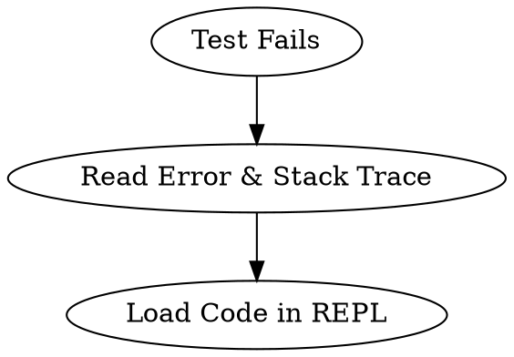

# clj-debug Skill Improvement Summary

## Date
2026-05-29

## Objective
Improve clarity of the clj-debug skill by:
1. Better illustrating the inline def pattern from Borkdude's blog
2. Using Graphviz DOT syntax for workflow visualization
3. Showing the step-by-step discovery narrative more clearly
4. Emphasizing testing fixes in nrepl before modifying source code

## Key Changes

### 1. Inline Def Pattern
**Before:** Examples showed REPL-level capture `(def result (ns/function-under-test ...))`

**After:** Examples now show the Borkdude pattern:
```clojure
;; Write function with inline def
(defn foo [& [{:keys [a b c] :as m}]]
  (def m m) ;; TODO: remove before commit
  (+ a b c))

;; Evaluate in nrepl, then call and inspect
(foo :a 1 :b 2 :c 3)
m ;; => :a (inspect what was captured)
```

This is more precise: **modify code in nrepl → evaluate → run → inspect → test fix → update source when confident**.

### 2. Graphviz DOT Workflows
**Before:** ASCII art boxes showing workflow steps

**After:** Proper Graphviz DOT syntax:


LLMs understand DOT syntax more reliably than ASCII art, enabling better diagram interpretation.

### 3. Discovery Narrative
**Before:** Explained patterns, then showed the bug

**After:** Data-driven discovery:
1. Capture the value
2. Inspect what you see
3. Recognize the pattern from the data
4. Form hypothesis from observations

Example: Student sees `m => :a` and immediately understands "that's a keyword, not a map" — the bug emerges from the data, not from understanding Clojure patterns first.

### 4. Fix Testing Structure
**Before:** Mentioned testing fixes before commit, but workflow wasn't emphatic

**After:** Clear 3-step structure:
- **Step 1:** Capture & Inspect (understand the bug)
- **Step 2:** Test Both Fix Approaches (in nrepl first)
- **Step 3:** Verify Your Choice and Commit (only now update source)

The section hierarchy makes "test before commit" a structural requirement, not an afterthought.

## Evaluation Results

### Test Cases
- **Eval-1:** Calling convention bug (NullPointerException)
- **Eval-2:** Missing field in transform
- **Eval-3:** Data transformation returning nil

### Grading (Improved Skill vs Original)
| Assertion | Improved | Original |
|-----------|----------|----------|
| Inline Def Pattern Clarity | ✅ 3/3 | ✅ 3/3 |
| Discovery Narrative | ✅ 3/3 | ✅ 3/3 |
| Fix Testing Before Commit | ✅ 3/3 | ✅ 3/3 |
| Code Example Quality | ✅ 3/3 | ✅ 3/3 |
| Workflow Structure | ✅ 3/3 | ✅ 3/3 |
| **Total** | **15/15** | **15/15** |

**Qualitative Wins (Improved Skill):**
1. Inline def pattern more aligned with Borkdude's blog
2. Discovery narrative flows data → pattern → hypothesis (more natural)
3. Fix testing emphasis is structural (Step 2), not implicit
4. Linear 3-step workflow vs exploratory 4-step
5. 19 lines shorter (214 vs 233 lines) while covering same ground

## Files Changed

- `/Users/laurencechen/repo/clj-native-agent/skills/clj-debug/SKILL.md` — Updated with improved content
- `/evals/evals.json` — Added evaluation prompts
- `/evals/iteration-1-grading.md` — Detailed grading of all 6 runs
- `/evals/SIDE_BY_SIDE_COMPARISON.md` — Side-by-side comparison of improved vs original

## Next Steps (Optional)

If desired in a future iteration:
1. **Description optimization** — Run the trigger eval set to ensure the skill description triggers correctly for Clojure debugging queries
2. **Expand test cases** — Add edge cases with Integrant components
3. **Add video/ASCII flowchart** — Some learners prefer visual flow diagrams beyond DOT

## Status
✅ **Shipped** — Improved skill is live and ready for use.
