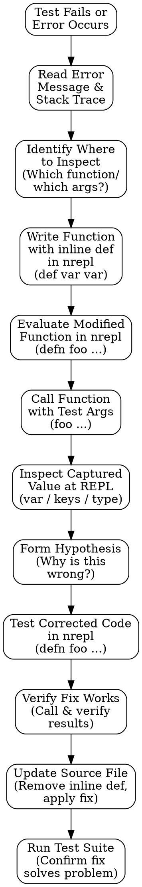
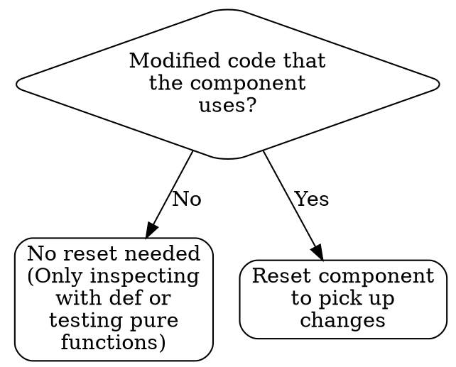

## Why REPL-based Debugging for Clojure

Adding logs and re-running tests creates a slow feedback loop. Clojure's REPL lets you inspect values directly at the point of failure, test fixes instantly, and validate corrections before touching the source file. This is faster and safer than println or formal debuggers.

## Core Pattern: Stop Before Logging

**RED FLAG:** You're about to add `println`, `tap>`, `(log ...)`, or modify source code to debug.

**Instead:** Use inline def in nrepl. Evaluate modified code directly without changing files, capture values, inspect them, test your fix, then commit with confidence.

## The Inline Def Pattern: Capture and Inspect

When a function fails, add a temporary `(def variable-name variable-name)` inside the function and evaluate the modified function in nrepl. This captures the value without changing the source file.

### Example: Discovering a Calling Convention Bug

Your function fails:

```clojure
(defn foo [& [{:keys [a b c] :as m}]]
  (+ a b c))

(foo :a 1 :b 2 :c 3)
;; => java.lang.NullPointerException
```

In nrepl, write the function with an inline def to capture the argument:

```clojure
;; Evaluate this in nrepl (don't modify the source file):
(defn foo [& [{:keys [a b c] :as m}]]
  (def m m) ;; TODO: remove before commit
  (+ a b c))

;; Now call it:
(foo :a 1 :b 2 :c 3)
;; => java.lang.NullPointerException

;; Inspect what was captured:
m
;; => :a
;;    Aha! m is :a, not a map. The caller is passing wrong format.
```

Now you understand the bug: the function expects a map `{:a 1 :b 2 :c 3}`, not keyword arguments.

### Example: Testing a Fix in nrepl Before Committing

Once you understand the problem, test the corrected version in nrepl:

```clojure
;; Test 1: Fix the calling convention
(foo {:a 1 :b 2 :c 3})
;; => 6   ✓ Works!

;; Test 2: Or fix the function to accept varargs correctly
(defn foo [& [{:keys [a b c] :as m}]]
  ;; No def here — we understand the bug now
  (+ a b c))

(foo {:a 1 :b 2 :c 3})
;; => 6   ✓ Verified!

;; Or change the function signature:
(defn foo [& args]
  (def args args) ;; Capture to verify varargs format
  (let [{:keys [a b c]} (first args)]
    (+ a b c)))

(foo {:a 1 :b 2 :c 3})
;; args => ({:a 1, :b 2, :c 3})   ✓ Correct format now
```

Once the fix works in nrepl, update the source file confidently. Remove any `(def ...)` lines before committing.

## Discovery and Fix Workflow

This is the complete cycle — use `/brepl` to evaluate each step:



## Working with Integrant Components

If the code uses Integrant components, understand this: **When you modify component code and evaluate it in nrepl, the running component may not pick up the change.** You'll see the old behavior even though the new code is loaded.

### When to Reset the Component

Use this decision tree:



**How to reset:**

```clojure
;; After evaluating your code change in nrepl:
(require '[your.component :as comp] :reload)

;; Reset the component to pick up the new code:
(ig/halt! @system :component-key)
(alter-var-root #'@system (fn [s] (ig/init (:system/config @system) :component-key)))

;; Now test again — the component reflects your change
```

## Quick Checklist

- [ ] Did I read the error message and stack trace?
- [ ] Did I identify which function and which argument to inspect?
- [ ] Did I write the function with `(def var var)` in nrepl?
- [ ] Did I evaluate the modified function definition?
- [ ] Did I call the function to trigger the capture?
- [ ] Did I inspect the captured variable (keys, type, values)?
- [ ] Did I form a hypothesis about what's wrong?
- [ ] Did I test the corrected code in nrepl first?
- [ ] Did I verify the fix works before modifying the source file?
- [ ] Did I remove the `def` line before committing?
- [ ] Did I consider component lifecycle (Integrant state)?
